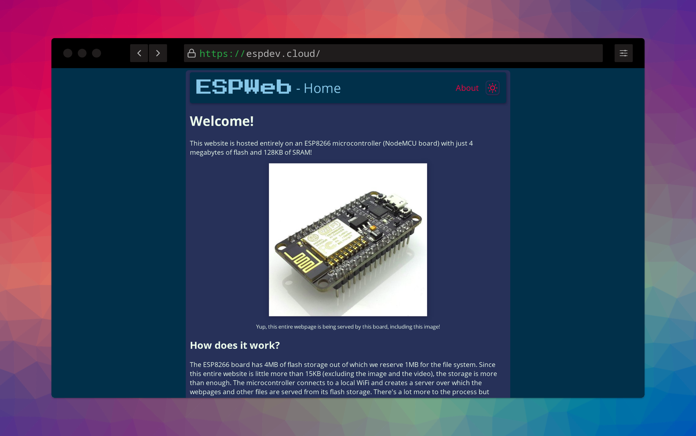
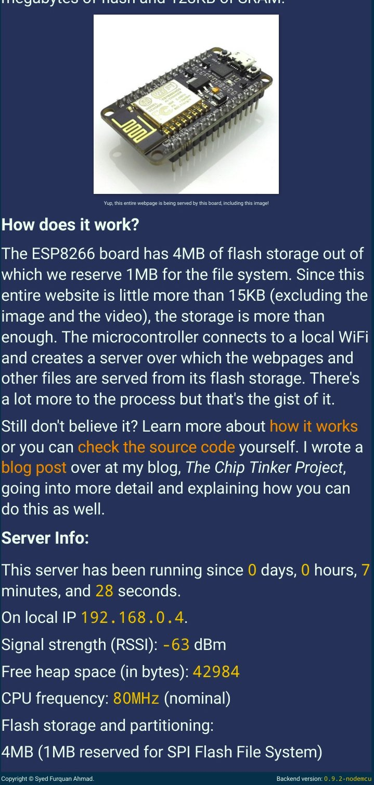

# ESPWeb
  

An entire website hosted on an ESP8266/ESP32 microconctroller board. Visit live at [esp.sorcerer.live](https://esp.sorcerer.live/).

## Legal
Copyright 2023 Syed Furquan Ahmad

Licensed under the Apache License, Version 2.0 (the "License");
you may not use this file except in compliance with the License.
You may obtain a copy of the License at

    http://www.apache.org/licenses/LICENSE-2.0

Unless required by applicable law or agreed to in writing, software
distributed under the License is distributed on an "AS IS" BASIS,
WITHOUT WARRANTIES OR CONDITIONS OF ANY KIND, either express or implied.
See the License for the specific language governing permissions and
limitations under the License.
